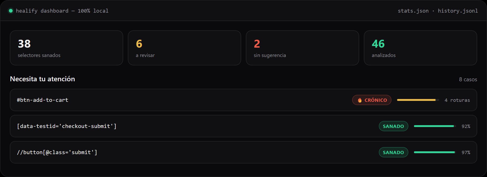

<div align="center">
  

  <h3>Fix your E2E tests before you even notice.</h3>
  <p><strong>E2E tests fail because of broken selectors. Fixing them is tedious and repetitive.<br/>Healify does it for you — local and deterministic, with zero data leaving your machine.</strong></p>

  
  
  
  <a href="https://github.com/mescobar996/Healify/actions/workflows/ci.yml"></a>
  
  

  <p>
    <a href="docs/"><strong>Docs</strong></a> ·
    <a href="examples/"><strong>Examples</strong></a> ·
    <a href="https://healify-sigma.vercel.app"><strong>Demo</strong></a> ·
    <a href="README.es.md">Español</a>
  </p>
</div>

---

| 🧪 Tests | 📦 Packages | 🔒 CLI coverage | ⚡ CI |
|---|---|---|---|
| **1,113** all passing | **9** `@healify/*` workspaces | **91.8%** line coverage | ✅ green on main |

---

## It fixes itself, before you even look

A button changed its `id` in the last deploy. The product didn't change — but your suite goes
red, and someone drops what they're doing to hunt the DOM by hand. Not anymore:

```diff
- await page.click('#add-to-cart-btn')
+ await page.getByRole('button', { name: 'Add to cart' }).click()
```

Done. Back to what you were doing.

## Five reasons to try it

| | Feature | What it means |
|---|---|---|
| 🔒 | **100% local** | No cloud, no account, no telemetry — nothing leaves your machine |
| 🧠 | **No AI** | Deterministic heuristics: same input, same output, every time |
| 🌐 | **Multi-framework** | One engine for Playwright, Cypress, Selenium and WebdriverIO |
| 📊 | **Local dashboard** | Your healings, history and 🔥 chronic selectors — `healify dashboard --serve` |
| ⚡ | **CI-ready** | `healify fix --pr` opens a PR with the fixes already applied |

## Try it in 30 seconds

```bash
npm install -g @healify/cli
cd your-project
healify fix --pr
```

---

## It doesn't guess

When your test fails, your framework has **already captured** what the page looked like at that
exact moment. Healify reads *that* evidence: there was a button whose accessible name was *"Add
to cart"*. The suggestion is verified against what was actually on screen, not against what a
language model thinks was probably there.

That's why it proposes roles and accessible names instead of another `id`: the new `id` will
change in the next deploy too. The button that says "Add to cart" won't.

## Nothing leaves your machine

No cloud. No account. No API key. No telemetry. No generative AI.

The whole analysis runs where you are, on deterministic heuristics: same input, same output,
every time. If you work with sensitive data (banking, healthcare, government) that isn't a
convenience, it's the only requirement that matters.

That's why the only metrics Healify keeps are **local**: `heal --stats` accumulates what it
healed in `~/.healify/stats.json` and prints a summary — nothing ever leaves the machine.

## How it compares

Playwright now ships its own healer agent, and every testing vendor sells "self-healing." The
label covers wildly different things, so here is where Healify actually sits:

| | Healify | Playwright's healer agent | Healenium |
|---|---|---|---|
| **How it decides** | Deterministic heuristics you can audit | An LLM, different answer each run | Similarity scoring against a database |
| **What leaves your machine** | Nothing | Your DOM goes to a model | Nothing, but needs a server |
| **To get started** | One `npx` | An API key and a budget | Docker + Postgres |
| **When it refuses** | Says so, and why | Rarely - it will propose something | On low similarity score |
| **Cost** | Zero, forever | Per token, forever | Infrastructure to run |

**The honest limit, up front:** broken selectors are roughly a quarter of why e2e tests fail. The
rest is timing, test data, runtime errors and real assertion failures. Healify names that quarter
and refuses the rest instead of guessing — a tool that "fixes" a failing assertion by swapping the
selector makes the test pass while hiding the bug it just caught. That is worse than a red build.

Healenium is genuinely well built and solves a different problem: yours doesn't need a database,
it needs someone to tell you "use this instead" before your coffee gets cold.

<sub>Fifteen tools in this space were researched before a single line was written
([full analysis](docs/research/competitive-gaps.md)).</sub>

## Works where you already are

**Playwright · Cypress · Selenium · WebdriverIO**

Including the hard places: inside web components with shadow DOM, across iframes, and when the
selector lives in a page object rather than in the test itself.

## It files the ticket for you

A red build nobody triages is a red build nobody fixes. Healify turns each broken selector into
a **Jira ticket or a GitHub issue**, with the evidence, the steps, the environment, and the
selector it suggests instead.

```bash
npx healify report --dry-run   # exactly what it would file, without touching the network
```

The same broken selector never files twice: every defect carries a stable id, and Healify
comments on the existing ticket instead of opening another one. Opt-in and off by default: your
credentials, your instance, no cloud of ours in between.

**[→ Jira, GitHub Issues and webhooks](docs/jira.md)**

## And it fixes the PR before you look at it

There's a [GitHub Action](docs/github-action.md). On every PR it runs `doctor` and the dry-run
fix, and posts a comment with what broke and what it would change — no bot admin rights, no
"all clear" when nothing actually ran.

For `workflow_dispatch` (manual) and `schedule` (daily) it goes further: reads your failed test
log, heals every broken selector, and opens a **pull request with the fixes already applied**.
Worried it can't parse your log? It says so and stops — it never fabricates a healing it can't
back with evidence.

```yaml
steps:
  - uses: actions/checkout@v4
  - uses: mescobar996/Healify@v2
    with:
      github-token: ${{ secrets.GITHUB_TOKEN }}
      test-log-path: test-output.log   # workflow_dispatch/schedule: log -> PR
```

**[→ Full action reference](docs/github-action.md) · [→ auto-PR example](examples/github-action-auto-pr/)**

## And it works in your editor

There's a [VS Code extension](vscode-extension/). Fragile selectors get underlined as you type.
The ones that actually broke get a verified fix on `Ctrl+.`

The two are deliberately different. Before you run anything, Healify can tell you a selector
looks brittle, but it won't suggest a replacement: without seeing the page, any specific name
would be made up. After a run, it knows the element exists and what it's called, so the fix is
real and applying it is one keystroke.

## And your agent can ask it questions

There's an [MCP server](mcp/). Point Claude, Cursor or any MCP client at your test project and it
can ask whether a selector is brittle, why a test failed, and which selectors keep breaking. It
answers in the syntax of the framework you're actually using (`framework: playwright | cypress |
selenium | webdriverio`), and `healify_batch_analyze_selectors` heals a whole page of broken
locators at once — results cached locally for 5 minutes, so an agent hammering the same selectors
doesn't recompute them.

```json
{ "mcpServers": { "healify": { "command": "npx", "args": ["-y", "@healify/mcp"] } } }
```

This is the complement to Playwright's MCP server, not a replacement. That one lets an agent
drive a browser. The documented failure of agents doing that is over-confidence: clicking the
first thing that matches, inventing what they can't see. Healify answers deterministically, from
evidence already on disk, and says plainly when it doesn't know — including refusing to name a
replacement it hasn't verified against a real page.

## And you can see the whole picture

`healify dashboard --serve` lifts a local server with Healify's interactive dashboard, showing
your accumulated statistics and the history of broken selectors — all from data that stays on
your machine.

```bash
healify dashboard --serve                 # port 5173 by default
healify dashboard --serve --port 8080     # any other port
healify dashboard --serve --open          # opens the browser for you
```

What it shows:

- **Aggregates from `~/.healify/stats.json`**: total analyzed, healed, failures, per-type
  breakdown, average healing time.
- **History from `.healify/history.jsonl`**: recurring selectors, re-broken ones, daily trend.
  A dedicated **🔥 Selectores Crónicos** section lists every selector that has broken 3 or more
  times, and a red **Crónico** badge marks them right in the main selectors list.
- **🎯 Eficacia** (new): how many fixes are actually accepted. A donut of accepted vs rejected
  vs unconfirmed (`healify confirm`), the acceptance rate per framework (Playwright, Cypress,
  Selenium, WebdriverIO — older history entries group under "unknown"), a 7/30-day trend and a
  breakdown by failure cause ("Selector roto", "Aserción", "Timing / espera", …).
- **JSON API** (optional): `GET /api/stats`, `GET /api/selectors`, `GET /api/selectors/:id`.
  `/api/stats` also accepts `?efficacy-window=7|30` to adjust the efficacy trend window.
- **React UI**: served from `dashboard-web/dist` when built; otherwise the server still answers
  the API with a fallback page.



Requires Node 20+.

**[→ Full dashboard reference](docs/DASHBOARD.md)**

## The repository

Healify is an npm monorepo with 9 workspaces, each an `@healify/*` package:

| Package | Role |
|---|---|
| `reporter-core` | The healing engine — heuristics, DOM probing, repertoire and shared config (private, not published) |
| `cli` | The command-line interface (`fix`, `init`, `doctor`, `history`, `heal`, `probe-script`, `ai`) |
| `test-runner` | Playwright adapter |
| `cypress-plugin` | Cypress adapter |
| `selenium-plugin` | Selenium adapter |
| `webdriverio-plugin` | WebdriverIO adapter |
| `dashboard-web` | React UI for the local dashboard |
| `ai-local` | Optional local AI via Ollama |
| `mcp` | MCP server for AI agents |

**Maturity:** 1113 unit tests, all passing. The CI runs coverage with **anti-regression
thresholds** defined in `scripts/coverage.sh` (Bash) and `scripts/coverage.ps1` (PowerShell):
every package already above 80% must stay there (test-runner keeps its 79 floor). Current line
coverage per package: `reporter-core` 93.4%, `selenium-plugin` 98.8%, `webdriverio-plugin`
87.6%, `cli` 91.8%, `cypress-plugin` 94.8%, `test-runner` 79.5%.

Gotchas worth knowing before you touch code: the workspaces import each other as
`@healify/reporter-core`, which resolves to the built `dist/` — so run `npm run build` before
testing an adapter from scratch.

**[→ Contributing guide](CONTRIBUTING.md)** · install, dev commands, commit policy and how to add a new adapter.

---

<div align="center">

### Start here

**[Documentation](docs/)** · installation, commands, configuration

**[Examples that actually run](examples/)** · complete projects, verified in CI against a real browser

**[Security](SECURITY.md)** · how to report a vulnerability

**[Demo](https://healify-sigma.vercel.app)**

</div>

---

<sub>
MIT · Every release signed and traceable to a public commit
(<a href="https://search.sigstore.dev/?packageName=%40healify">verify it here</a>) ·
© 2026 Matías Escobar, Rosario, Argentina
</sub>
